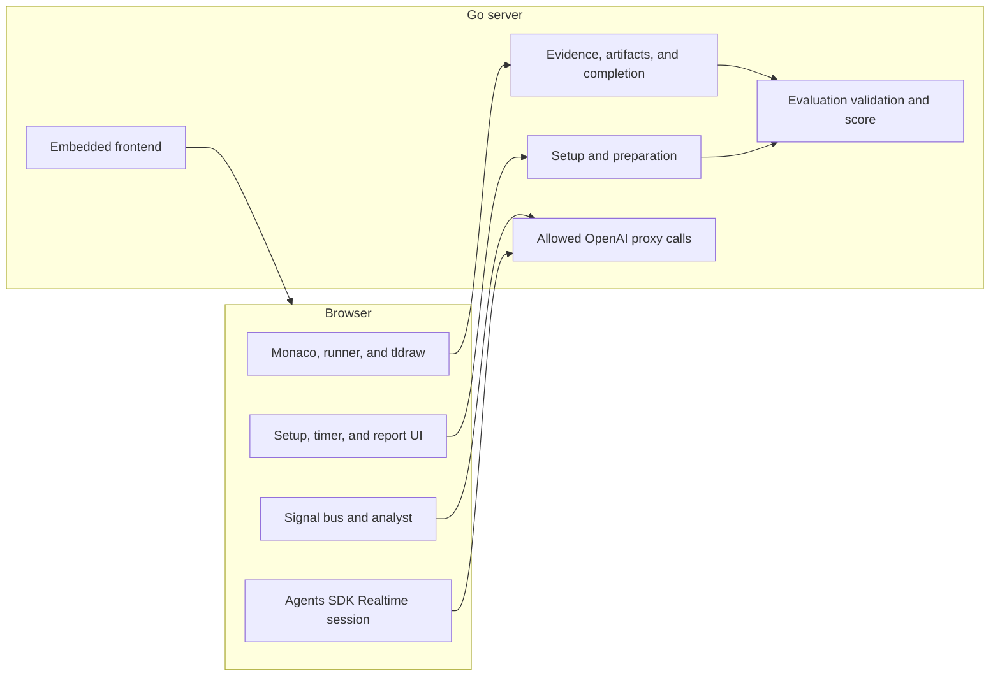
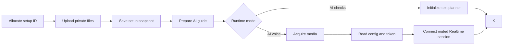
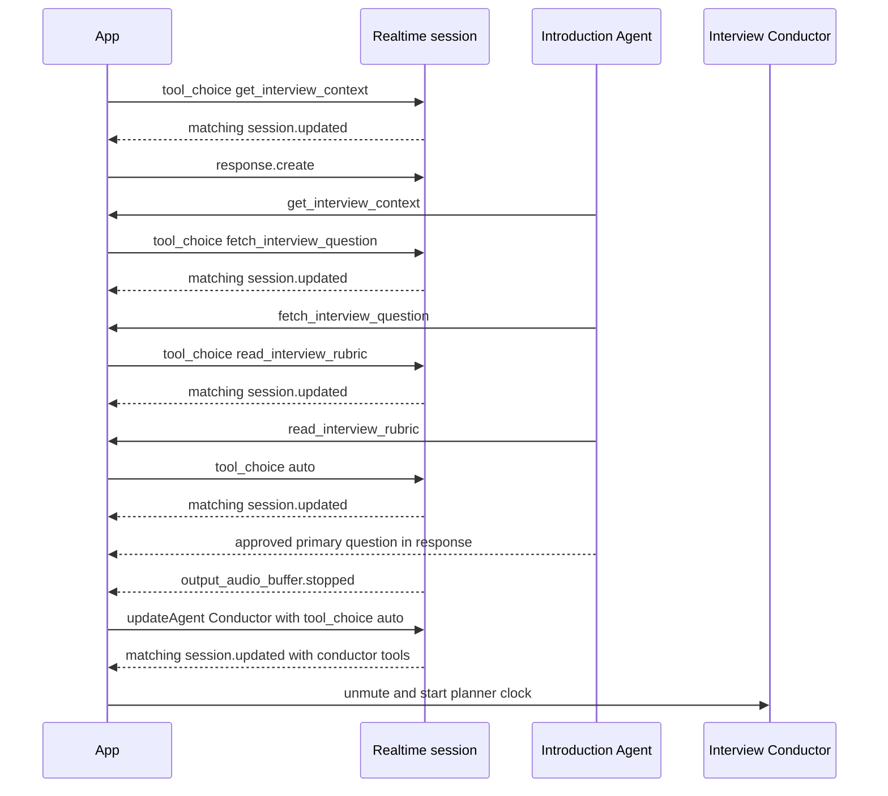
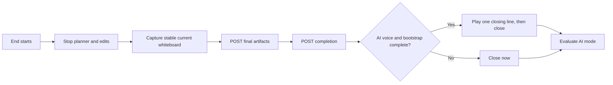

# Signal Interview — High-Level Design

## 1. Purpose

Signal Interview runs a timed technical interview on one local machine. A candidate can speak, write TypeScript, run browser checks, and draw on a whiteboard. The app records technical evidence and can create a rubric report after the interview.

The product supports a human assessment. It does not make an employment decision.

## 2. Ownership boundaries

The Go server owns durable and authoritative data:

- setup identity and saved setup snapshots
- private uploads
- prepared questions, rubric criteria, and weights
- verified executable fixtures
- evidence, final artifacts, completion, and evaluation records
- final rubric metadata and weighted score
- the permanent OpenAI API key

The browser owns live interaction state:

- Monaco code and revisions
- tldraw scene state and revisions
- browser-isolated test runs
- candidate media and local recording
- live transcript and agent state
- planner timing, quiet gates, and pending questions

The browser cannot replace the prepared question, rubric, artifact set, or score during evaluation.

## 3. Runtime modes

`INTERVIEW_DEVELOPER_MODE=true` exposes the text-only AI checks test mode alongside the default AI voice experience.

| Mode | Preparation | Interview | Completion |
|---|---|---|---|
| AI checks | Server uses the configured preparation model | Text planner questions. No Realtime or media. | Stores artifacts and completion, then evaluates. |
| AI voice | Server uses the configured preparation model | Realtime speech, planner, media, and local recording | Stores artifacts and completion, then evaluates. |

The production frontend includes Monaco, Monaco workers, tldraw, fonts, and icons.

## 4. System context



## 5. Setup and startup transaction

The browser creates a 32-character lowercase-hex setup ID before its first upload or setup request. It keeps progress for uploads, setup save, preparation, configuration, token, and connection. A retry reuses the ID and each successful phase result.



The timer starts only after the selected runtime is ready. Voice recording starts only after media and Realtime connection succeed. A startup rollback closes the session, stops all media tracks, clears the recorder and recording URL, and keeps the setup screen visible.

Setup snapshots are immutable per ID. The first save returns `201`. An identical retry returns `200`. A different snapshot returns `409`.

Prepared guides are fixed per setup ID. The first request returns `201`. An identical retry returns `200`. An invalid stored guide returns `422`.

## 6. Realtime bootstrap and handoff

The Realtime session connects with automatic tool choice and candidate input muted. Parallel tool calls are disabled. `begin()` then controls introduction through provider session updates.



Each tool callback also validates its phase. An out-of-order tool call fails and does not advance bootstrap. `read_interview_rubric` remains available after bootstrap.

The Introduction Agent stays active until the exact approved question completes playback. Markdown and whitespace normalization can confirm a streamed copy of that question. A rejected output item never enters the transcript, planner input, or evaluation.

Bootstrap has a bounded timeout. Timeout and early completion close the session once. They do not start the ten-second final-audio fallback.

## 7. Live interview components

### 7.1 Candidate workspace

The prepared guide enables code, whiteboard, both, or neither.

- Monaco uses the prepared TypeScript starter code and tracks a code revision.
- A Web Worker runs visible checks and captures console output.
- tldraw tracks a whiteboard revision and produces a compact scene summary.
- A PNG is attached only when the whiteboard is non-empty and the revision is stable.

Disabled workspaces remove their data and agent tools. Verified solution and buggy fixtures remain server-private. The candidate UI has no controls that load them.

### 7.2 Agent roles

- The Introduction Agent presents the prepared interview.
- The Interview Conductor runs the main assessment.
- The Reflection Agent probes final tradeoffs, complexity, and gaps.

The conductor and reflection agent can read the enabled workspace, latest run, and prepared rubric. They can record evidence. They cannot access disabled workspace data.

### 7.3 Output safety

One local output-safety validator covers analyst questions, analyst findings, and Realtime output. It blocks hints, code, pseudocode, direct solution terms absent from the approved prompt, praise, advice, unsupported correctness claims, and judgments about appearance, accent, personality, confidence, hesitation, uncertainty, friendliness, hostility, or emotion.

The exact approved prompt can pass during bootstrap. Invented code or solution content remains blocked afterward. Guardrail checks are local and make no model call.

## 8. Planning and delivery

A one-second signal bus watches code, whiteboard, tests, transcript, rubric coverage, asked questions, stage, status, and timing. The bus itself makes no model call.

A question can dispatch only when all five gates pass:

1. 45 seconds passed since the most recently confirmed question delivery.
2. Code has been quiet for three seconds.
3. The whiteboard has been quiet for two seconds.
4. The agent is listening.
5. More than 20 seconds remain.

A blocked signal stays pending. Analysis does not start while the agent speaks or thinks, or while code or whiteboard work is active.

The planner fingerprints every external input. It covers signal kind, code and whiteboard revisions, run identity, relevant transcript, timing, plan areas and coverage, prepared question and rubric identity, observations, asked questions, stage, and status. A material change cancels the current generation. The bus checks the full fingerprint and all five gates after every awaited analysis or evidence write. A stale result creates no evidence, question, or activity.

Precompute runs at most once per gate window, including a null result. A material change invalidates it.

A queued voice question remains pending until its matching response completes playback. The raw `output_audio_buffer.stopped` event confirms delivery. AI checks confirms delivery when the text question enters the UI. The 45-second clock starts at that confirmation time.

## 9. Evidence contract

Every evidence request has this shape:

```json
{
  "sessionId": "0123456789abcdef0123456789abcdef",
  "eventId": "89abcdef0123456789abcdef01234567",
  "category": "complexity",
  "observation": "Candidate derived linear time from one traversal.",
  "confidence": 0.9,
  "codeRevision": 17,
  "whiteboardRevision": 4
}
```

`eventId` is a stable 32-character lowercase-hex idempotency key. A retry sends the exact ID and payload. Categories must be a prepared criterion ID or `code_execution`. Confidence must be between zero and one. Revisions must be nonnegative.

One test run creates one durable `code_execution` event. The planner can update local coverage after the server acknowledges that event. It does not persist a second copy of the same fact.

Planner evidence keeps the code and whiteboard revisions that the analyst read. Coverage increases only after persistence succeeds. A failure shows a visible retry action.

## 10. Ending and final artifacts

Manual and timer endings share one lifecycle guard. The first request fixes `sessionId`, `reason`, and `elapsedSeconds`. A retry reuses the exact payload.



Whiteboard capture snapshots the revision before exports and after both exports. It accepts only equal revisions and retries a bounded number of times. An older result never overwrites a newer preview or final capture.

Final artifact storage makes no AI call. Required fields are `sessionId`, `codeRevision`, `code`, `whiteboardRevision`, and `whiteboardSummary`. The scene and PNG may be empty. The first payload returns `201`, an identical retry returns `200`, and a different payload returns `409`.

Completion is idempotent for the exact reason and elapsed time. A conflict returns `409`. The finished screen appears only after the backend acknowledges completion. A failed artifact or completion write keeps a visible retry action and does not claim success.

## 11. Evaluation Manager

AI checks and AI voice send this request after final artifact and completion storage:

```json
{
  "sessionId": "0123456789abcdef0123456789abcdef",
  "transcript": [
    { "role": "candidate", "text": "I will test the empty input." }
  ]
}
```

No other evaluation input is accepted. The server loads the saved setup, prepared guide, evidence, immutable artifacts, and completion. It calls the configured Responses model with a strict schema.

The model returns recommendation, summary, strengths, risks, limitations, and one judgment for each prepared criterion ID. The server rejects missing, duplicate, invented, or malformed criteria. It restores criterion names and weights and computes the weighted score.

Evaluation is idempotent. An identical transcript retry returns the stored report without a provider call. A different transcript for the same session returns `409`.

## 12. API surface

| Method | Endpoint | Purpose |
|---|---|---|
| `GET` | `/api/health` | Server health |
| `GET` | `/api/config` | Planner models and developer-mode state |
| `POST` | `/api/interview/uploads` | Private setup file upload |
| `POST` | `/api/interview/setups` | Immutable setup snapshot |
| `GET` | `/api/interview/setups/{id}` | Saved setup read |
| `POST` | `/api/interview/setups/{id}/prepare` | Immutable prepared guide |
| `POST` | `/api/realtime/token` | Short-lived Realtime client secret |
| `POST` | `/api/openai/v1/responses` | Restricted planner Responses proxy |
| `POST` | `/api/interview/evidence` | Idempotent evidence event |
| `POST` | `/api/interview/artifacts` | Immutable final artifacts without AI |
| `POST` | `/api/interview/complete` | Idempotent terminal event |
| `POST` | `/api/interview/evaluate` | Idempotent final evaluation |

The server has no local chat route, local question route, or manual Realtime SDP route. Unknown `/api/` paths return `404`.

## 13. Local persistence

```text
runtime/
├── setups/{setupId}/
│   ├── setup.json
│   ├── prepared.json
│   └── uploads/
├── artifacts/{sessionId}/
├── evidence.jsonl
├── completions.jsonl
└── evaluations.jsonl
```

The server constrains runtime paths, creates directories with owner-only permissions, and writes private files with owner-only permissions. Runtime data is not source data and must stay out of Git.

## 14. Network and secret boundary

The default address is `127.0.0.1:8080`. A key-bearing process rejects a non-loopback bind unless `INTERVIEW_ALLOW_UNSAFE_NETWORK_BIND=true`. That flag is an explicit unsafe opt-in. The app has no user authentication.

Browser mutation requests must have the same origin. Requests without a browser `Origin` header remain available to local tools. Paid endpoints allow four active requests and 30 starts per minute. API responses use `no-store` and security headers.

The permanent key remains on the server. The browser receives only a short-lived Realtime secret. Planner requests can reach only the allowed Responses proxy path.

The app loads its bundled Monaco and tldraw assets from the local frontend.

## 15. Models, assets, and tracing

Default models are:

- Realtime: `gpt-realtime-2.1-mini`
- Evaluation: `gpt-5.6-terra`
- Observer and orchestrator: their explicit values, or the evaluation model

Agents SDK tracing is disabled in the browser. The application does not export agent traces. Server logs contain safe error classes and provider request IDs. They do not log the API key or raw candidate reports.

The production build bundles Monaco and tldraw assets. Local HTTP use needs no tldraw production key. Hosted HTTPS use needs a valid `VITE_TLDRAW_LICENSE_KEY`.

## 16. Build and release controls

`make install` uses the lockfile through `npm ci`. `make check` runs frontend unit tests, TypeScript checking, and Go tests.

`make build` is canonical. It writes `cmd/server/webdist` before building `bin/interviewer`. A separate freshness gate builds the frontend in a temporary directory and compares it byte for byte with the embedded files.

`make release-check` adds browser runtime-mode tests, Go race tests, Go vet, the canonical production build, and the freshness comparison. `make doctor` checks the local toolchain and configuration without calling a provider or printing a key.

`make clean-build` removes only the generated server binary, Go build cache, and compiled frontend test cache. Runtime deletion is a separate destructive command. It needs `CONFIRM_PURGE_RUNTIME=DELETE_RUNTIME`.

## 17. Failure behavior

| Failure | Behavior |
|---|---|
| Upload, setup, or preparation fails | Keep the setup screen and reuse successful startup phases on retry. |
| Media, config, token, or connection fails | Roll back session, media, recorder, and recording URL. |
| Bootstrap times out | Close once and show a retryable startup error. |
| Evidence save fails | Keep local coverage unchanged and show a retry action. |
| Artifact or completion save fails | Keep the exact ending payload and show a retry action. |
| Evaluation fails | Keep the completed session and show a retry action. |
| Final audio does not finish | Close voice after the bounded fallback. |

## 18. Production work

The local design still needs these controls before public deployment:

- user authentication and per-session authorization
- tenant isolation
- a transactional database and object storage
- recording consent, retention, export, and deletion controls
- a production sandbox for untrusted code
- automated policy and score calibration against human-reviewed interviews
- monitoring for service health, cost, and abuse
