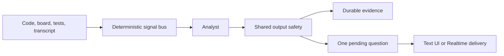

# Plan 03 — Orchestrator architecture

Status: implemented.

## Purpose

A planning layer decides when and what to ask. The Realtime voice agent delivers a validated finished question. It stays silent when no useful probe exists.

## Components



- The signal bus makes no model call.
- The analyst can return up to three findings and one question.
- The question queue holds one unconfirmed delivery.
- The voice layer receives exact approved text.

## Dispatch gates

All five gates run before analysis, before persistence, and before queueing:

1. 45 seconds since the last confirmed question delivery
2. three seconds of code quiet
3. two seconds of whiteboard quiet
4. agent status is listening
5. more than 20 seconds remain

A blocked signal remains pending. Active speech, thought, typing, or drawing blocks analysis.

## Freshness

The planner fingerprints every external input:

- signal kind
- code and whiteboard revisions
- latest run identity
- relevant transcript
- current time gates and remaining time
- prepared question and rubric identity
- rubric areas and coverage
- current observations
- asked questions
- interview stage and agent status

Every material change increments a cancellation generation. The planner snapshots the full fingerprint before any awaited model or evidence operation and recomputes it afterward. A stale result creates no evidence, question, or activity. All gates run again.

Precompute runs at most once per gate window. A null response still consumes that attempt. A material input change invalidates the window result.

## Output validation

One validator covers analyst questions, analyst findings, and Realtime output. It rejects:

- unknown prepared criterion IDs
- confidence outside zero to one
- an empty basis
- multiple or repeated questions
- questions over 12 words
- hints, coaching, praise, or prescriptive advice
- code, pseudocode, or direct solution terms absent from the approved prompt
- unsupported correctness claims
- appearance, accent, personality, confidence, hesitation, uncertainty, friendliness, hostility, or emotion judgments

Invalid output is visible as planner validation activity. It is never persisted or queued.

## Evidence

Evidence uses a stable 32-character lowercase-hex event ID and includes both analyzed revisions. The browser awaits each save. Coverage increments only after acknowledgement. A failed save stays retryable with the exact payload.

One browser run owns its one `code_execution` event. The planner does not duplicate it.

## Question delivery

AI checks confirms delivery when the text question enters the candidate UI.

Voice delivery associates the queued question with its Realtime response and output item. It tolerates Markdown and whitespace normalization. Raw `output_audio_buffer.stopped` confirms playback. The next 45-second window starts from that event.

## Models and tracing

`OPENAI_OBSERVER_MODEL` and `OPENAI_ORCHESTRATOR_MODEL` fall back to `OPENAI_EVALUATION_MODEL`. The default evaluation model is `gpt-5.6-terra`.

Browser Agents SDK tracing is disabled. Planning calls use the same-origin Responses proxy. The permanent key stays on the server.

## Verification

```bash
make check
make browser-test
make check-web-freshness
```
