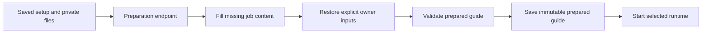

# Interview preparation

Status: implemented.

## Flow

## Rules

- Candidate name, interview type, duration, workspaces, tools, and channels stay fixed.
- AI can fill missing role details, question types, brief, rubric, and interview pattern.
- Explicit owner role and rubric values override AI output.
- Candidate sources can tailor job-related questions. They cannot become scoring evidence.
- Code-editor interviews use the verified server TypeScript catalog.
- AI-generated executable code, checks, solutions, and buggy fixtures cannot control v1 execution.
- Candidate prepared responses contain prompt, starter code, and candidate-safe checks. They contain no solution or buggy fixture.
- Behavioral and system-design interviews can use a spoken prompt without code checks.

## Idempotency

`POST /api/interview/setups/{id}/prepare` creates `runtime/setups/{id}/prepared.json` once.

- First successful preparation: `201`
- Identical retry: `200`
- Incompatible stored guide: `422`

Every later evidence, artifact, completion, and evaluation request reloads and validates the saved setup and prepared guide.

## Runtime use

- AI checks uses AI preparation and then starts a text planner without Realtime or media.
- AI voice prepares before it acquires media, mints a token, connects, and begins ordered bootstrap.

## Terminal lifecycle

The terminal order is fixed:

1. `POST /api/interview/artifacts`
2. `POST /api/interview/complete`
3. `POST /api/interview/evaluate`

Final artifacts contain current code plus a revision-stable whiteboard. Artifact storage makes no AI call and is immutable per session.

Evaluation accepts only `sessionId` and transcript. The server loads the prepared question, rubric, evidence, and immutable artifacts. It owns rubric metadata and score arithmetic. Identical retries return the stored evaluation. A different transcript returns `409`.

## Failure behavior

- Missing AI configuration returns a safe preparation error before interview start.
- Provider authentication, quota, rate, timeout, and availability failures use stable public error codes.
- An invalid provider guide gets one correction attempt, then a retryable error.
