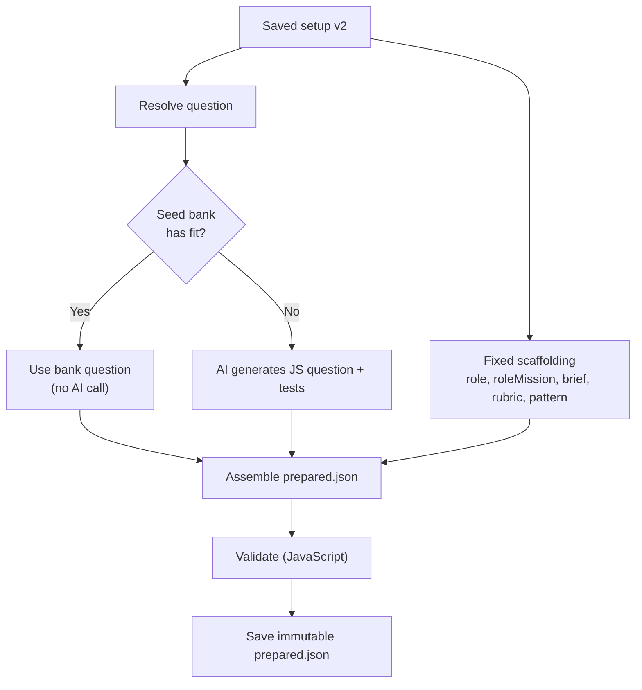
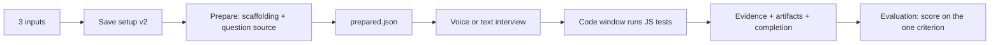

# Minimal setup and AI question bank

Status: proposed. Date: 2026-08-16.

## 1. Goal

Start an interview from three inputs. Fix every other decision. Route those inputs to a question source that picks a question from a seed bank or generates one.

The setup snapshot is the config object. Every input and fixed decision is a field on it. A new input plugs in by adding one field and reading it in the question source. No pipeline rewiring.

## 2. Scope

Collected inputs:

- Candidate name
- Seniority
- Duration in minutes

Fixed decisions:

| Decision | Value |
|---|---|
| Interview type | Coding (DSA) |
| Language | JavaScript |
| Workspace | Code editor only, with execution |
| Channel | Voice |
| Rubric | One criterion: "Problem solving and correctness", weight 100 |
| Role title | Not collected. Defaults to "Software Engineer". |
| Candidate context | Not collected. |

## 3. Non-goals

- No résumé, links, brief, or uploads.
- No whiteboard.
- No rubric editor.
- No multi-criterion scoring.
- No stored or growing question bank across interviews. The bank is a shipped seed file.

## 4. The config object

The saved setup snapshot is the config object. It slims to version 2.

```
InterviewSetup v2
├─ setupId
├─ version = 2
├─ candidate.name        ← input
├─ role.level            ← input (seniority)
└─ interview
   ├─ type = "coding"           ← fixed
   ├─ codingLanguage = "javascript"  ← fixed
   ├─ durationSeconds           ← input
   ├─ questionTypes = ["problem_solving"]  ← fixed
   ├─ workspaces = ["code_editor"]         ← fixed
   ├─ tools = []                ← fixed
   └─ channels = ["voice"]      ← fixed
```

Removed from the snapshot: `candidate.sources`, `candidate.reviewedFacts`, `role.title`, the whole `brief` object, and the whole `rubric` object. The fixed rubric moves to the prepare step. Survivor field paths stay the same to limit downstream churn.

Adding a new input later:

```
1. collect it in setup  →  2. add a field to InterviewSetup  →  3. read it in the question source
```

## 5. Setup screen

The five-step wizard collapses to one screen with three fields.

```
┌─────────────────────────────┐
│  Candidate name   [_______] │
│  Seniority        [▼ Mid  ] │
│  Duration (min)   [  30   ] │
│        [ Start interview ]  │
└─────────────────────────────┘
```

The browser sends the three inputs plus the fixed values in one save request. Wizard steps, file fields, rubric rows, and access toggles are removed.

## 6. Prepare step

Prepare assembles fixed scaffolding in code and resolves the question through the question source. The AI runs only when the bank has no fit.



Fixed scaffolding, built in code:

- `role.title` = "Software Engineer". `role.level` = seniority.
- `roleMission` = a fixed template naming seniority and DSA.
- `brief` = a fixed template for a focused DSA coding interview.
- `rubric` = one criterion: id `problem_solving_correctness`, name "Problem solving and correctness", weight 100, expected evidence describing a working, well-reasoned solution.
- `pattern` = a fixed short pattern that covers solve and review within the duration.

## 7. Question source

### Difficulty map

| Seniority | Difficulty |
|---|---|
| Entry-level, Mid-level | easy |
| Senior | medium |
| Staff, Principal | hard |

### Seed bank

A shipped server file, `questions/bank.json`. A list of JavaScript DSA questions. Each entry:

```json
{
  "id": "two-sum",
  "difficulty": "easy",
  "language": "javascript",
  "entryFunction": "twoSum",
  "prompt": "…",
  "starterCode": "function twoSum(nums, target) {\n  // …\n}",
  "tests": [ { "args": [[2,7,11,15], 9], "expected": [0,1] } ],
  "demo": { "solution": "…", "buggy": "…" }
}
```

v1 ships at least one question per difficulty. Solutions and buggy fixtures stay server-private. They never reach the browser.

### Selection

Plain code, no AI. Map seniority to difficulty. Filter the bank to that difficulty. Pick one by hashing the setup ID over the bucket. The pick is deterministic per setup and varies across setups. Prepare stores the result once, so retries stay stable.

### Generate fallback

Runs only on a bank miss for the target difficulty. The AI call is scoped to a question only, not the whole guide. It returns id, entry function, prompt, JS starter code, tests, solution, and buggy fixture. The prompt fixes JavaScript and the target difficulty. One correction retry on invalid output, then a provider-guide error.

The old whole-guide generation and the verified TypeScript catalog (`questions/default.json`) are removed.

## 8. JavaScript switch

Lift the "must be TypeScript" guards and set the editor language.

| Location | Change |
|---|---|
| `cmd/server/setup.go` | Language check requires JavaScript when the code editor is enabled. |
| `cmd/server/prepare.go` | Prepared and question validation require JavaScript. |
| `web/src/setup/prepared.ts` | `parsePreparedInterview` requires JavaScript. |
| `web/src/App.tsx` | Monaco `<Editor language="javascript">`. |
| Seed bank + generation | JavaScript starter code and solutions. |

Execution already runs JavaScript. The worker receives compiled JS today. The engine does not change. The plan verifies the JS emit path.

## 9. Deep prune

The user chose a deep prune. Remove the following.

Frontend:

- Wizard steps for role details, context, uploads, rubric, and access.
- Whiteboard: `WhiteboardPanel.tsx`, the `whiteboard/` directory, and the tldraw dependency.
- Whiteboard capture and plumbing in `App.tsx`.
- Résumé, links, reviewed facts, brief, and rubric fields in `setup/types.ts` and `setup/api.ts`.

Backend:

- Upload endpoint and its handler, plus attachment loading in prepare.
- `candidate.sources`, `candidate.reviewedFacts`, `role.title`, `brief`, and `rubric` from the setup struct.
- Whiteboard fields in the evidence and artifact contracts.
- The verified TypeScript catalog file and its loader.

Tests:

- Update `cmd/server/main_test.go` for the slimmed setup, JavaScript, the seed bank, and the removed whiteboard and upload paths.

## 10. What stays unchanged

- Voice bootstrap, Realtime, media, and local recording.
- Live follow-up questions: the signal bus and observers.
- AI checks text mode. Kept as a test harness for this build phase.
- Evidence, final artifacts, completion, and the end evaluation report.
- Setup and prepared idempotency and immutability. Setup save returns 201, 200, or 409. Prepared returns 201, 200, or 422.

## 11. End-to-end data flow



## 12. Error handling

- Bank hit needs no API key. Prepare can succeed offline for the common path.
- Bank miss with no API key returns a configuration error.
- Bank miss with a provider failure uses the existing provider error classes.
- Invalid generated question gets one correction retry, then a provider-guide error.
- Invalid stored guide returns 422.

## 13. Testing

Server:

- Each seniority resolves to a JavaScript bank question of the mapped difficulty.
- Selection is deterministic per setup and stable across retries.
- The generate fallback runs on a forced bank miss and validates as JavaScript.
- Setup v2 validation accepts the three inputs and rejects removed fields.
- Idempotency holds for setup and prepared.

Browser:

- Setup sends the three inputs and fixed values.
- `parsePreparedInterview` accepts a JavaScript guide.
- The runner executes JavaScript and grades tests.

Manual:

- One end-to-end interview in text mode. Read the question, write JS, run tests, get a score.

## 14. Risks

- The whiteboard and upload prune touches the durable evidence and artifact contracts and the large Go test file. It is the widest change. The plan sequences it last so an end-to-end interview works before the durable contracts are cut.
- AI-generated tests are not verified. A bad generated test can fail a correct solution. This is accepted for the build phase. Seed-bank questions carry verified tests, so the common path is safe.
